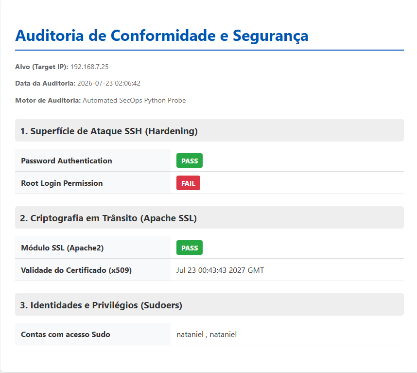

# Linux InfraSec Automator 🛡️⚙️

A comprehensive Lifecycle Automation Suite designed to provision, secure, and audit virtualized Linux web server environments. 

This project demonstrates an end-to-end infrastructure pipeline, encompassing hypervisor interactions, cryptographic deployments, and agentless security compliance auditing.

## 🏗️ Architecture & Modules

The suite is divided into three core operational phases:

### 1. Provisioning (`1_Provisioning/vbox_provisioner.py`)
Automates the creation of Linux Mint virtual machines via VirtualBox APIs (VBoxManage).
* **Unattended Installation:** Fully automated OS bootstrap.
* **Identity & Access Management:** Generates secure ED25519 SSH key pairs and provisions dedicated service accounts.
* **Initial Hardening:** Enforces Zero-Trust principles by disabling `PasswordAuthentication` natively.

### 2. Web Deployment & TLS (`2_Web_Deployment/ssl_orchestrator.py`)
Orchestrates the deployment of web services (Apache2) over secure channels.
* **Idempotent Execution:** Purges legacy configurations before deploying new states.
* **Cryptography in Transit:** Remotely generates x509 Self-Signed Certificates (RSA 2048) with Subject Alternative Name (SAN) support.
* **Access Control:** Applies Least Privilege ACLs (750) and configures secure SFTP symlinks for remote administration.

### 3. Security Operations (`3_Security_Ops/secops_auditor.py`)
An agentless compliance scanner that acts as the final verification gate.
* Connects via secure ED25519 keys to extract raw system telemetry.
* Audits `sshd_config` policies, SSL module active states, and elevated privileges (Sudoers).
* Generates dynamic, executive-ready HTML reports locally.

## 📊 Compliance Reporting Dashboard

The SecOps module generates a local HTML dashboard providing immediate visibility into the server's security posture. 

*(Example of a generated audit report highlighting a successfully hardened SSH service alongside a deliberately flagged Root Login policy):*



## 🚀 Getting Started

### Prerequisites
* Python 3.10+
* Oracle VirtualBox (added to System PATH)
* Target OS ISO (e.g., Linux Mint/Ubuntu)

### Installation
1. Clone the repository:
   ```bash
   git clone [https://github.com/yourusername/Linux-InfraSec-Automator.git](https://github.com/yourusername/Linux-InfraSec-Automator.git)

### Library Installation
To execute the automation scripts, you need to install the required external Python libraries. The project includes a `requirements.txt` file for ease of setup.

1. Open your terminal (PowerShell, Command Prompt, or Bash).
2. Navigate to the root directory of the project.
3. Run the following command to install the required libraries:
   ```bash
   pip install -r requirements.txt

### SSH Key Permissions (Windows)
If you are running these scripts on a Windows host, SSH clients and Paramiko may reject the generated private key (.pem) if its file permissions are too open. Run the following commands in your terminal (Command Prompt or PowerShell) to restrict access strictly to your user:

1. Remove inherited permissions:
   ```bash
   icacls "your_private_key.pem" /inheritance:r

2. Grant full control only to your current Windows user:
   ```bash
   icacls "your_private_key.pem" /grant:r "$($env:USERNAME):F"

### Execution
Execute the modules sequentially to provision, configure, and audit your environment:
1. python "1_Provisioning/vbox_provisioner.py"
2. python "2_Web_Deployment/ssl_orchestrator.py"
3. python "3_Security_Ops/secops_auditor.py"